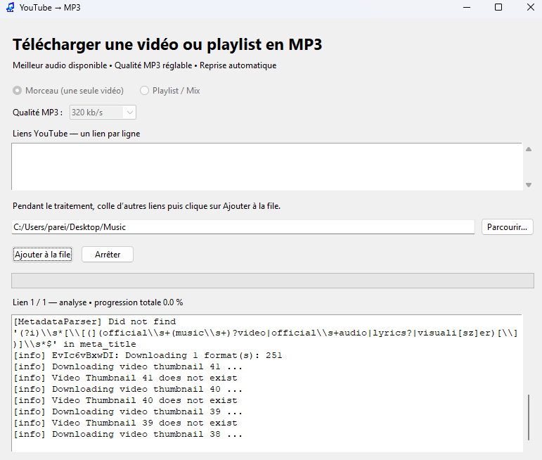

# YouTube MP3

<p align="center">
  
</p>

<p align="center">
  <strong>Téléchargez vos vidéos et playlists YouTube autorisées en MP3.</strong><br>
  Une application simple, rapide et accessible à tous.
</p>

<p align="center">
  
  
  
</p>

## Aperçu

<p align="center">
  
</p>

## Présentation

YouTube MP3 est une application graphique permettant de convertir des vidéos YouTube en fichiers MP3.

Elle récupère automatiquement, lorsque les informations sont disponibles :

- le titre ;
- l’artiste ;
- les métadonnées ;
- la pochette de l’album.

L’application propose deux modes :

- **Morceau** : télécharge une seule vidéo ;
- **Playlist / Mix** : télécharge une playlist complète ou un Mix YouTube.

## Fonctionnalités

- Téléchargement d’un ou plusieurs liens YouTube.
- Prise en charge des vidéos, playlists et Mix.
- File d’attente de téléchargement.
- Ajout de liens pendant un téléchargement.
- Bouton d’arrêt.
- Barre de progression avec pourcentage, vitesse et temps restant.
- Qualité MP3 sélectionnable : 128, 192, 256 ou 320 kb/s.
- Nettoyage automatique des noms de fichiers.
- Métadonnées intégrées dans les fichiers MP3.
- Pochette intégrée automatiquement.
- Notifications à la fin du téléchargement.
- Destination et préférences conservées automatiquement.

## Installation sous Windows

### Méthode recommandée

1. Ouvrez la page **Releases** du projet.
2. Téléchargez `YouTube-MP3-Windows.zip`.
3. Extrayez l’archive.
4. Double-cliquez sur `Installer.bat`.

L’installateur télécharge automatiquement :

- yt-dlp ;
- FFmpeg ;
- Deno.

Il crée ensuite un raccourci **YouTube MP3** sur le Bureau.

Python n’est pas nécessaire pour l’utilisateur final : il est intégré dans l’exécutable.

## Utilisation

1. Sélectionnez le mode **Morceau** ou **Playlist / Mix**.
2. Collez un ou plusieurs liens YouTube.
3. Choisissez le dossier de destination.
4. Sélectionnez la qualité audio.
5. Cliquez sur **Télécharger**.

### Mode Morceau

En mode **Morceau**, un lien contenant un Mix automatique reste limité à une seule vidéo.

```text
https://www.youtube.com/watch?v=VIDEO_ID&list=RDVIDEO_ID&start_radio=1
